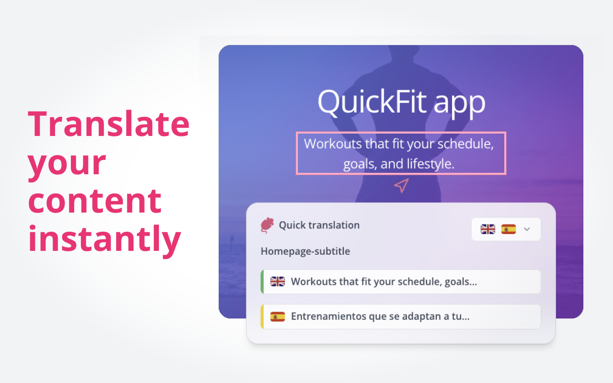
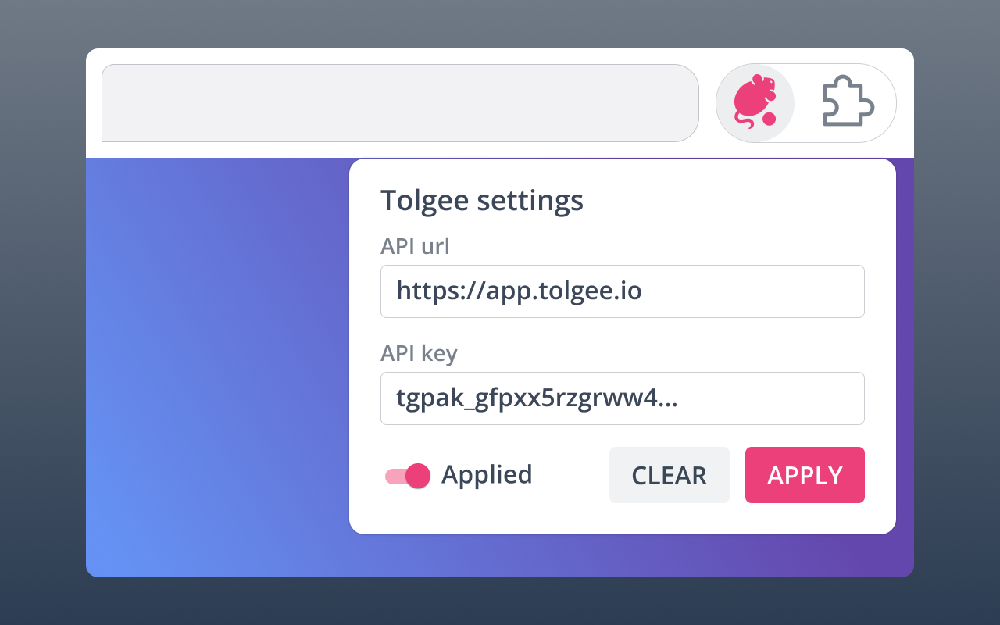

# Tolgee browser plugin

Translate your web application more effectively with Tolgee plugin!

Tolgee Chrome plugin is an integral part of Tolgee ecosystem. It enables tolgee-js to take screenshots automatically.

With the Tolgee plugin, you can modify translations live on your page, so you can see the location of all translations. Find out how exactly the page will look with the newly added translation. 

## Install Extension

You can download our Chrome browser extension on Chrome Web Store:

## Additional information

To learn more visit [https://tolgee.io](https://tolgee.io)

Or visit our main GitHub page: [https://github.com/tolgee/tolgee-platform](https://github.com/tolgee/tolgee-platform)

👇 Concider supporting us with your stars ⭐️

## How to

 1. Install Tolgee Tools plugin
 2. Go to the production version of your website, which is using Tolgee SDK
 3. Click on Tolgee Tools extension and apply your API key
 4. You are done! In-context translating should work

## Features

 • Quick screenshot capture for app localization
 • In-context localization on production

