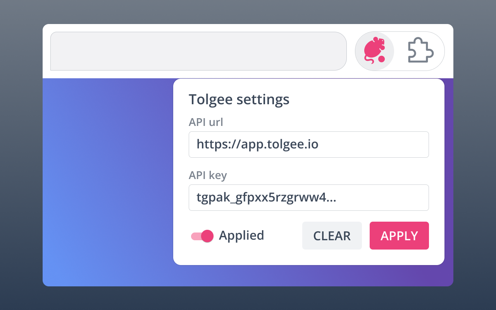

<h1 align="center" style="border-bottom: none">
    <b>
        <a href="https://chromewebstore.google.com/detail/tolgee-tools/hacnbapajkkfohnonhbmegojnddagfnj?hl=en">Tolgee Chrome Browser Plugin</a> 
    </b>
 Modify your translations live and   take screenshots automatically
</h1>

Translate your web application more effectively with the Tolgee plugin!

## Tolgee Chrome plugin is an integral part of Tolgee ecosystem

## Features

### - Quick screenshot capture for app localization

You can capture a screenshot of your application with highlighted phrases for translation with just one click. Hold ALT/Option + click on a string, then hit the camera button. Your screenshot is instantly generated.

### - In-context localization on production

Hold the ALT/Option key and click on an element to open a dialog where you can modify your strings effortlessly — no need to navigate through bulky .json/.po/.whatever files.

Plus, in-context translation works seamlessly, even in the production environment.

## Install Extension

You can download our Chrome browser extension on the Chrome Web Store:

## Additional information

To learn more, visit [https://tolgee.io](https://tolgee.io)

Or visit our main GitHub page: [https://github.com/tolgee/tolgee-platform](https://github.com/tolgee/tolgee-platform)

👇 Consider supporting us with your stars ⭐️

## How to

1.  Install Tolgee Tools plugin
2.  Go to the production version of your website, which is using Tolgee SDK
3.  Click on Tolgee Tools extension and sign in with your Tolgee account, or apply an API key
4.  You are done! In-context editing should work

### Signing in with a Tolgee account

Signing in needs the site to declare its `projectId` in the Tolgee SDK configuration and an SDK that speaks the
extension's protocol 2 (planned for the `@tolgee/web` 7.2.0 release). The extension signs you in through Tolgee's OAuth authorization server and keeps the access token in its own
service worker only. The page never receives it: the SDK hands every Tolgee API request to the extension, which
attaches the token, performs the request and returns the response. Screenshots are captured and uploaded by the
extension too. A page can only reach the project it was signed in for, on the server it was signed in to; anything
else is refused.

The popup's in-context editing switch only controls whether alt+click editing is turned on for the current page; it
is not a session control. Turning editing off does not end the OAuth session: the origin stays connected, and the
session stays valid (available to be turned back on with a click) until you sign out, or until it goes 30 days
without being used.

### Connecting with a project API key

A project API key entered in the extension stays in the extension as well: the page is only told that a connection
exists, and the extension sends the SDK's requests (screenshot uploads included) with the key, pinned to the key's
own project. When a page declares another project than the key belongs to, edits go to the key's project. A key the
site ships in its own Tolgee configuration (development mode) is used by the page directly, as before.

Signing in needs that SDK; on an older one the extension asks for an SDK update and offers the API key instead. A
key applied on such a page is written into the page's session storage (`__tolgee_apiKey`), where the older SDK
picks it up and sends its own requests with it, as extension releases before the relay did; the popup's summary says
so. Which way a key is delivered is decided from the SDK in front of the popup each time the key is handed over,
so a site that updates its SDK gets the key moved into the extension the next time the popup opens on the page.

### The request relay

The relay (`src/content/apiProxyRelayScript.ts`) is a content script that runs at `document_start` on every
http(s) page. It has to be listening before the SDK's first request leaves, which happens as soon as the in-context
bundle loads, before `DOMContentLoaded`, and `window.postMessage` has no queue: a later listener would miss it and
the page would only see a timeout. It reads nothing from the page and holds no credential: it forwards the page's
own `TOLGEE_*` messages to the service worker, which decides whether that origin is connected at all, and posts the
reply back.

## License

This project is licensed under the MIT License (see [LICENSE](LICENSE)). It also inlines a small number of
third-party icon assets under a different license; see [NOTICE](NOTICE) for details.
